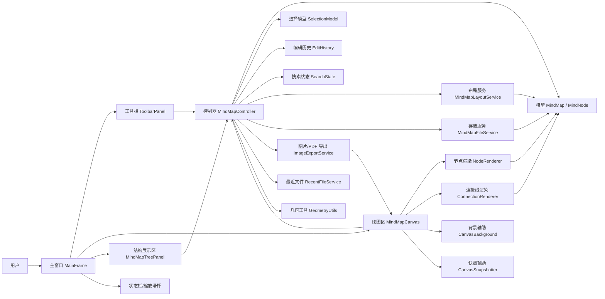
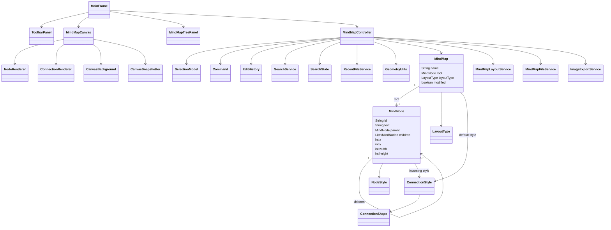
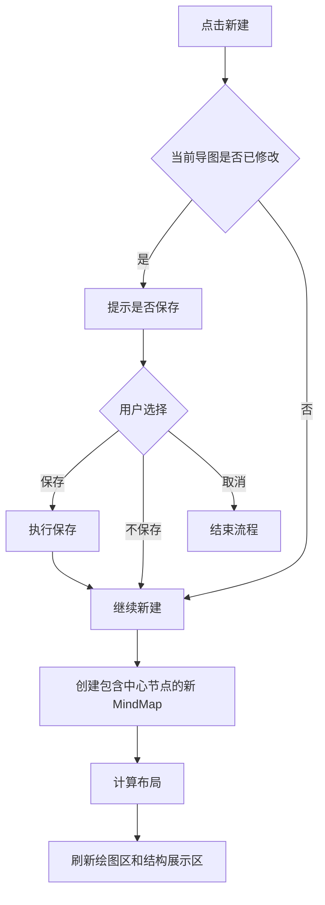
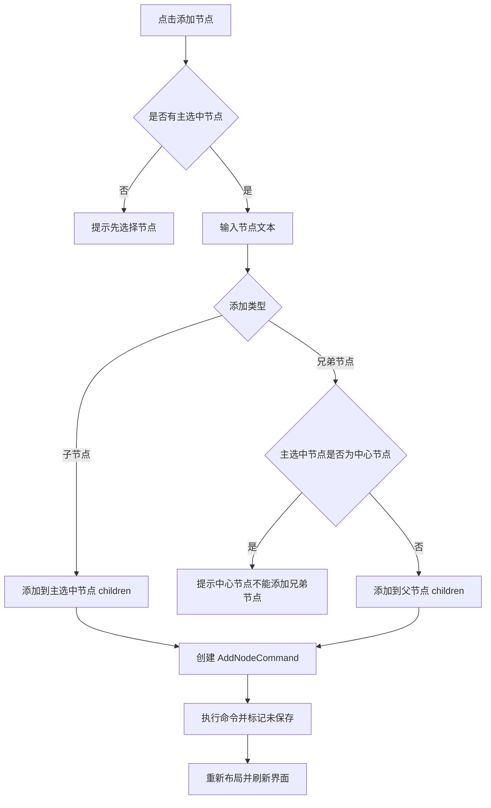
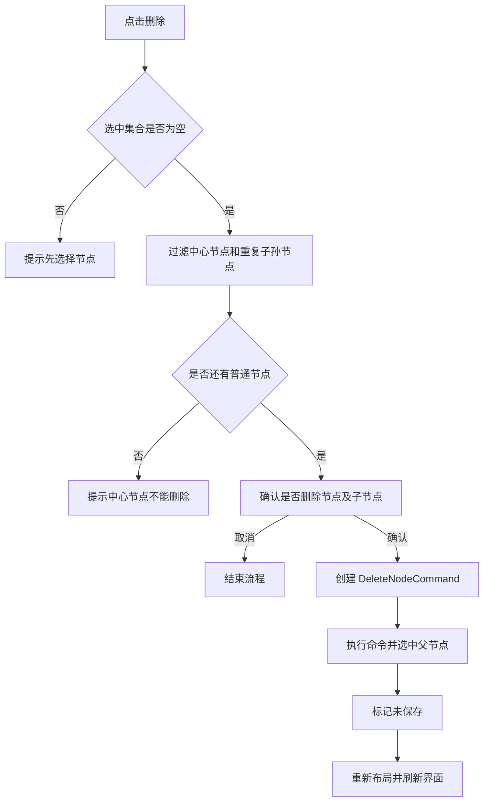
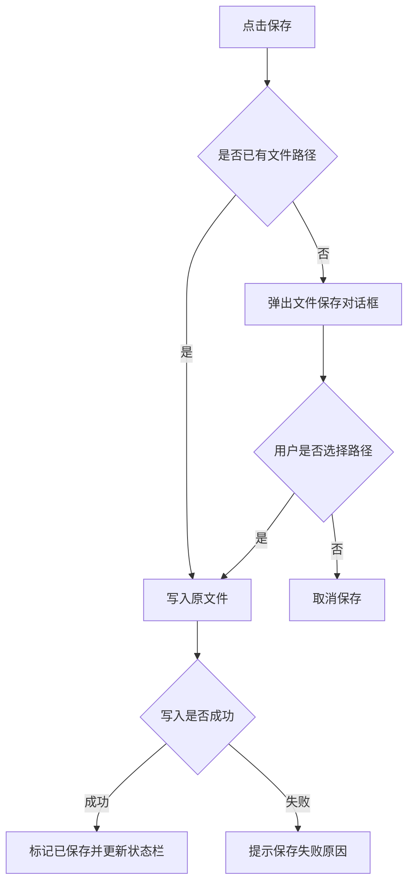
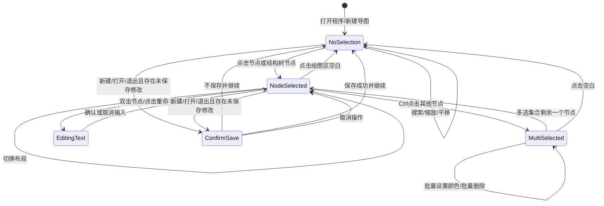

# 思维导图绘制工具需求分析与详细设计

## 0. 文档依据与设计取向

本项目题目为“思维导图绘制工具”。题目要求使用 Java 图形用户界面技术实现一个能够创建、编辑、保存、打开并导出思维导图的应用程序。课程论文参考文档要求正文至少包含系统分析、系统设计、系统实现、系统测试、系统运行界面和总结等部分，其中本文件重点覆盖“系统分析”和“系统设计”，后续可继续扩展为完整课程论文。

本设计确定采用 JavaFX 实现界面，采用 MVC 思想组织代码，使用自定义 XML 文件格式保存思维导图数据。选择 JavaFX 的原因是其组件体系现代，适合实现思维导图这类节点图形工具；`Pane`、`Canvas`、`TreeView`、`ToolBar`、`ColorPicker` 等组件能够较自然地支撑绘图、结构展示和交互编辑。选择 XML 的原因是 Java 标准库原生支持 XML 读写，文件结构清晰，便于调试和展示“自定义存储格式”。

## 1. 系统分析

### 1.1 问题描述

思维导图是一种以中心主题为核心，通过树形层级关系组织关键词、任务或想法的图形化表达方式。一个最基本的思维导图可以抽象为一棵树：根节点是中心节点，根节点向外连接多个子节点，每个子节点又可以继续包含自己的子节点。

本系统需要实现一个桌面端思维导图绘制工具。用户可以新建一个只包含中心节点的思维导图，在绘图区查看和编辑节点，在结构展示区查看树形结构，并通过工具栏完成新建、打开、保存、导出、添加节点、删除节点和设置布局等操作。

### 1.2 用户角色

本系统面向普通课程用户或轻量级思维导图用户，主要角色为“思维导图编辑者”。该角色需要完成以下工作：

1. 创建一个新的思维导图。
2. 对节点进行选择、添加、删除和编辑。
3. 通过树形结构查看当前导图层级。
4. 将导图保存为可再次打开编辑的文件。
5. 将导图导出为 jpg、png 图片或 pdf 文档。
6. 根据需要切换自动布局、左侧布局和右侧布局。

### 1.3 系统边界

系统主要处理本地桌面端的思维导图编辑，不涉及多人协作、云端同步、账号登录或复杂权限管理。

系统输入包括：

1. 用户通过鼠标和按钮发出的操作指令。
2. 用户输入的思维导图名称、节点文本、文件名和导出路径。
3. 已保存的思维导图文件。

系统输出包括：

1. 绘图区中的思维导图图形。
2. 结构展示区中的树形结构。
3. 自定义格式的思维导图文件。
4. jpg、png 格式的导出图片或 pdf 格式的导出文档。
5. 操作成功、失败或确认删除等提示信息。

### 1.4 功能性需求

#### 1.4.1 新建思维导图

用户点击“新建”后，系统创建一张新的思维导图。新导图初始状态只包含一个中心节点，默认文本可设置为“中心主题”或“中心节点”。系统应清空当前绘图区和结构展示区中的旧内容，并显示新导图。

如果当前导图存在未保存修改，系统应提示用户是否保存后再新建。

#### 1.4.2 保存思维导图

用户点击“保存”后，系统将当前导图保存为自定义格式文件。首次保存时应弹出文件选择框，由用户指定文件名和保存位置；非首次保存时可直接覆盖原文件。

文件扩展名确定为 `.mindmap`。文件内容采用 XML 格式保存导图名称、布局方式、节点编号、节点文本、父子关系、节点样式等信息。

#### 1.4.3 打开思维导图

用户点击“打开”后，系统从磁盘选择一个 `.mindmap` 文件并解析。解析成功后，系统在绘图区显示导图，在结构展示区同步显示树形结构。

如果文件格式不正确或读取失败，系统应显示错误提示，并保持当前导图不被破坏。

#### 1.4.4 导出图片

用户点击“导出”后，系统将当前绘图区中的思维导图导出为 jpg、png 图片或 pdf 文档。用户可选择导出路径和文件格式。

导出时应包含当前显示状态下的完整导图内容，而不是只截取当前窗口可见区域。系统通过计算可见节点包围矩形，使用 JavaFX 快照生成图片，再写入 png、jpg 或 pdf 文件。

#### 1.4.5 选中节点

用户在绘图区中点击某个节点时，该节点进入选中状态。选中节点应通过不同的背景色、边框色或加粗边框与普通节点区别。

当用户点击空白区域时，系统取消所有节点的选中状态。系统需要同时支持单选和多选：普通点击用于单选节点，按住 Ctrl 后点击节点用于加入或移出多选集合。多数编辑命令默认作用于单个主选中节点，颜色设置和删除等命令可作用于多个选中节点。

#### 1.4.6 添加节点

添加节点前必须存在一个选中节点。

如果选中节点是中心节点，系统允许为其添加子节点。如果选中节点是普通节点，系统允许添加子节点，也允许添加兄弟节点。添加节点后，系统应重新计算布局，刷新绘图区，并同步更新结构展示区。

为简化交互，工具栏可提供“添加子节点”和“添加兄弟节点”两个按钮；当中心节点被选中时，“添加兄弟节点”按钮置灰。

#### 1.4.7 删除节点

删除节点前必须存在一个选中节点。用户点击“删除节点”后，系统删除该节点及其全部子节点，并同步更新绘图区和结构展示区。

中心节点禁止删除。若用户选中中心节点并执行删除，系统提示“中心节点不能删除”，避免出现空导图。

#### 1.4.8 设置布局

当选中中心节点时，用户可以设置导图布局方式。系统至少支持三种布局：

1. 自动布局：中心节点的一级子节点平均分布在中心节点左右两侧，并尽量使左右两侧高度接近。
2. 左侧布局：中心节点的所有一级子节点都排列在中心节点左侧。
3. 右侧布局：中心节点的所有一级子节点都排列在中心节点右侧。

布局变更后，系统应重新计算所有节点坐标，并刷新绘图区和结构展示区。

#### 1.4.9 编辑节点文本

题目未明确要求节点文本编辑，但作为思维导图工具，添加节点后必须能够设置节点内容，因此本系统将“编辑节点文本”作为必要补充功能。用户可通过双击节点或点击“重命名”按钮修改节点文本。

#### 1.4.10 结构展示同步

右侧结构展示区应实时反映当前导图的树形结构。新增、删除、重命名、打开文件、新建文件和布局切换后，结构展示区都应同步刷新。

用户在结构展示区点击某个树节点时，也可以同步选中绘图区对应节点，形成双向联动。

#### 1.4.11 多选节点

系统需要支持节点多选。用户通过普通单击选中一个节点，通过 Ctrl + 单击将节点加入当前选择集合或从选择集合中移除。多选状态下，最后一次被选中的节点称为主选中节点。

多选主要用于批量删除和批量设置颜色。添加子节点、添加兄弟节点、重命名等需要明确目标节点的操作，默认作用于主选中节点。

#### 1.4.12 节点拖拽

系统需要支持节点拖拽。用户按住鼠标左键拖动选中节点时，节点可以随鼠标移动。拖拽普通节点时，其子节点应作为一个整体跟随移动，以保持思维导图分支的相对结构。

拖拽后，系统应记录节点的手动偏移量，并将导图标记为未保存。用户切换自动布局、左侧布局或右侧布局时，可重新按布局算法整理节点位置。

#### 1.4.13 颜色设置

系统需要支持节点颜色设置。用户选中一个或多个节点后，可以通过颜色选择器修改节点背景色和边框色。颜色修改后，绘图区立即刷新，结构展示区可保持文本结构不变。

颜色信息属于导图数据的一部分，应保存到 `.mindmap` 文件中，并在打开文件时恢复。

#### 1.4.14 撤销与重做

系统需要支持撤销和重做。用户对导图执行添加节点、删除节点、重命名、布局切换、拖拽节点、设置颜色等修改操作后，可以通过“撤销”回到上一步状态，也可以通过“重做”恢复被撤销的操作。

撤销和重做只处理导图编辑操作，不处理打开、导出、窗口滚动、节点选择等非数据修改操作。

#### 1.4.15 节点折叠与展开

系统需要支持节点折叠与展开。对于包含子节点的节点，绘图区应显示折叠/展开控制点。用户点击控制点后，可以隐藏或显示该节点的子孙节点。

折叠只影响显示效果，不删除节点数据。折叠状态属于导图数据，应保存到 `.mindmap` 文件中，并在打开文件时恢复。

#### 1.4.16 画布缩放与平移

系统需要支持画布缩放与平移。用户可以通过工具栏按钮或快捷键放大、缩小、恢复 100% 显示，也可以通过滚动区域查看大尺寸导图。

缩放和平移只影响当前查看方式，不修改导图数据，因此不改变未保存状态，也不进入撤销重做栈。

#### 1.4.17 快捷键

系统需要提供常用快捷键，提高编辑效率。至少支持新建、打开、保存、撤销、重做、添加子节点、添加兄弟节点、删除、重命名、查找、缩放等操作。

快捷键触发的效果应与点击工具栏按钮或右键菜单保持一致。

#### 1.4.18 右键菜单

系统需要支持节点右键菜单。用户右键点击节点时，系统先选中该节点，再弹出上下文菜单。菜单中提供添加子节点、添加兄弟节点、重命名、删除、设置颜色、折叠/展开等常用操作。

右键菜单中的按钮可用状态应与工具栏保持一致，例如中心节点不能删除，中心节点不能添加兄弟节点。

#### 1.4.19 搜索节点

系统需要支持节点搜索。用户可以输入关键词查找节点文本，系统应高亮匹配节点，并能够定位到上一个或下一个匹配结果。

搜索不修改导图数据，不改变未保存状态。搜索结果高亮应与节点选中状态区分开。

#### 1.4.20 节点文本自动换行

系统需要支持节点文本自动换行。节点文本过长时，不应无限横向扩展，而应在最大宽度内自动换行，并根据文本行数调整节点高度。

节点自动换行会影响布局计算，因此布局服务需要根据节点实际尺寸计算子树高度和节点坐标。

#### 1.4.21 最近打开文件

系统需要支持最近打开文件列表。用户成功打开或保存某个 `.mindmap` 文件后，系统将该文件路径加入最近打开列表。用户可从菜单或工具栏下拉项中快速重新打开最近文件。

最近打开文件属于本地用户配置，不保存到 `.mindmap` 文件中。

#### 1.4.22 查找替换

当前项目在搜索节点的基础上进一步支持查找替换。用户可通过“开始”功能区中的“查找替换”按钮或 `Ctrl + F`、`Ctrl + H` 打开查找替换窗口。系统在用户输入关键词后即时高亮匹配节点，支持上一个、下一个匹配结果定位，也支持替换当前匹配项和全部替换。

查找本身不修改导图数据；替换会修改节点文本，因此需要进入撤销重做历史，并标记导图为未保存。替换过程采用忽略大小写的文本匹配方式，避免用户输入大小写不同导致无法命中英文节点文本。

#### 1.4.23 Ribbon 风格工具栏

当前界面将传统单行按钮工具栏改为接近办公软件的 Ribbon 风格功能区。顶部左侧提供醒目的“文件”入口和撤销、重做快速按钮，中间按“开始”“样式”“布局”“导出”划分功能页签，页签内部再按文字、颜色、节点、查找、画布、连接线、文件导出等场景分组。

该设计使高频编辑命令和样式命令在界面上有清晰归类，解决按钮过多时文字被压缩为省略号的问题，并便于在后续继续扩展功能。

#### 1.4.24 节点文字样式与节点尺寸调整

系统支持设置节点文字字体、字号、加粗、斜体、下划线、删除线、文字颜色和对齐方式。双击节点时不再弹出简单输入框，而是在节点内部切换为文本编辑状态，用户可直接修改文本内容。

选中节点后，绘图区显示八个缩放控制点，用户可通过拖动控制点调整节点尺寸。手动尺寸属于节点样式数据的一部分，需要保存到 `.mindmap` 文件中，并在重新打开时恢复。

#### 1.4.25 连接线对象选择与样式设置

系统将父子节点之间的连接线视为可交互对象。用户可单击连接线选中该线，按住 Ctrl 单击可多选连接线；连接线被选中时显示半透明高亮层和控制点，避免直接覆盖用户设置的真实线条颜色。

连接线样式包括颜色、粗细、实线或虚线、曲线或折线。若用户已选中连接线，样式修改作用于选中的连接线；若未选中连接线，则修改导图默认连接线样式，新建节点继承默认样式。

#### 1.4.26 框选与全选

系统支持 `Ctrl + 鼠标左键拖动` 框选，框选区域既可以选中节点，也可以选中与选择框相交的连接线。普通左键拖动画布仍用于画布平移或避免误触发框选。

系统还支持 `Ctrl + A` 全选。当焦点位于文本输入框中时保留输入框自身的全选行为；当焦点不在文本输入框中时，选中当前导图全部节点以及所有非根节点对应的连接线。

#### 1.4.27 画布背景与导出进度

系统支持设置画布背景色和画布背景图片。背景色和背景图片 URI 保存到 `.mindmap` 文件中；导出 PNG、JPG 和 PDF 时，快照结果应包含当前画布背景，保证导出结果与编辑界面一致。

高清导出可能耗时较长，因此系统在导出时显示进度窗口。进度窗口先提示正在生成高清画布快照，随后提示正在写入目标格式文件，导出完成或失败后自动隐藏并更新状态栏。

#### 1.4.28 PDF 导出

除题目要求的 JPG 和 PNG 外，当前项目增加 PDF 导出能力。PDF 导出复用高清画布快照，将快照转换为不透明 RGB 图像后写入单页 PDF，便于用户提交、打印或在 PDF 阅读器中查看。

PDF 导出不改变导图数据，不修改未保存状态。

#### 1.4.29 结构栏收起与状态栏统计

右侧结构展示区支持收起和展开。结构栏展开时显示完整树形结构，收起时保留窄栏和展开按钮，让绘图区获得更多可用空间。底部状态栏左侧显示最近操作结果，中部保留弹性空白，右侧显示字数、主题数和缩放滑杆。

缩放控制位于右下角，包含缩小按钮、缩放滑杆、放大按钮和百分比按钮。缩放范围限制为 30% 到 300%，百分比按钮可恢复 100% 显示。

#### 1.4.30 全部展开与全部收起

系统支持一键展开全部节点和一键收起全部分支。全部展开用于快速查看完整导图结构；全部收起用于在复杂导图中只保留高层主题，便于概览。该操作会改变节点折叠状态，因此进入撤销重做历史并标记导图为未保存。

### 1.5 非功能性需求

1. 易用性：主要功能集中在工具栏，用户能够通过鼠标完成核心操作。
2. 稳定性：打开错误文件、保存失败、导出失败等场景应有错误提示，不应导致程序崩溃。
3. 可维护性：系统采用模型、视图、控制器分离，避免将数据处理、绘图逻辑和按钮事件全部混在一个类中。
4. 可维护性补充：后期实现中将撤销重做、搜索状态、几何命中、节点渲染、连接线渲染、背景处理和快照导出拆分到独立类，降低 `MindMapController` 和 `MindMapCanvas` 的职责集中度。
5. 可扩展性：系统将节点拖拽、颜色设置、撤销重做、折叠展开、画布缩放平移、快捷键、右键菜单、搜索替换、文本自动换行、最近打开文件、连接线样式、PDF 导出和画布背景作为明确功能纳入设计，并保留继续扩展其他能力的空间。
6. 兼容性：保存文件使用文本化 XML 格式，便于跨机器复制和调试；读取旧文件时对缺失的新属性提供默认值，避免早期 `.mindmap` 文件无法打开。
7. 安全性：读取 XML 文件时禁用外部实体和外部 DTD，避免不可信文件触发 XML 外部实体解析风险。

### 1.6 开发平台及工具

开发环境确定如下：

1. 编程语言：Java。
2. GUI 技术：JavaFX。
3. 开发工具：IntelliJ IDEA。
4. JDK 版本：JDK 20.0.2，与当前项目 Maven 配置保持一致。
5. 数据存储：自定义 XML 文件，扩展名 `.mindmap`。
6. 图片和 PDF 导出：JavaFX `snapshot` 生成 `WritableImage`，再转换为 `BufferedImage`；PNG/JPG 通过 `ImageIO` 写出，PDF 通过程序生成单页 PDF 文档。
7. 构建方式：Maven Wrapper。
8. JavaFX 依赖：`javafx-controls`，版本 `17.0.2`。
9. 单元测试：JUnit Jupiter `5.8.2`，通过 Maven Surefire `3.2.5` 执行。
10. 模块声明：`module-info.java` 声明 `javafx.controls`、`java.desktop`、`java.prefs`、`java.xml`。其中 `java.desktop` 用于 `BufferedImage` 和 `ImageIO`，`java.prefs` 用于最近文件记录，`java.xml` 用于 `.mindmap` 文件读写。

## 2. 系统设计

### 2.1 总体结构设计

系统采用 MVC 分层结构：

1. Model 层负责维护思维导图数据，包括导图名称、布局方式、节点树、节点编号、节点样式、连接线样式和画布背景。
2. View 层负责界面展示，包括主窗口、Ribbon 工具栏、绘图区、结构展示区、状态栏和弹窗。
3. Controller 层负责响应用户操作，协调模型更新、文件读写、布局计算、历史记录和界面刷新。
4. Service 层负责相对独立的功能，如文件持久化、图片/PDF 导出、布局计算、最近文件、搜索和撤销重做历史。
5. Renderer/Helper 类负责绘图区内部的节点渲染、连接线渲染、背景样式和导出快照，避免一个画布类承担过多职责。

系统总体模块如下：



### 2.2 包结构设计

包结构设计如下，与当前 Maven 项目的基础包名保持一致：

```text
com.example.mindmap
  MindMapApplication.java
  model/
    MindMap.java
    MindNode.java
    LayoutType.java
    NodeStyle.java
    ConnectionStyle.java
    ConnectionShape.java
    SelectionModel.java
  view/
    MainFrame.java
    MindMapCanvas.java
    MindMapTreePanel.java
    ToolbarPanel.java
    NodeRenderer.java
    ConnectionRenderer.java
    CanvasBackground.java
    CanvasSnapshotter.java
  controller/
    MindMapController.java
  command/
    Command.java
    AddNodeCommand.java
    DeleteNodeCommand.java
    RenameNodeCommand.java
    MoveNodeCommand.java
    ChangeStyleCommand.java
    ChangeLayoutCommand.java
    ToggleCollapseCommand.java
  service/
    MindMapLayoutService.java
    MindMapFileService.java
    ImageExportService.java
    SearchService.java
    SearchState.java
    RecentFileService.java
    EditHistory.java
  util/
    Dialogs.java
    GeometryUtils.java
```

### 2.3 核心类设计

#### 2.3.1 MindMap

`MindMap` 表示一整张思维导图。

主要属性：

| 属性 | 类型 | 说明 |
| --- | --- | --- |
| name | String | 思维导图名称 |
| root | MindNode | 中心节点 |
| layoutType | LayoutType | 当前布局方式 |
| filePath | Path | 当前保存路径 |
| modified | boolean | 是否存在未保存修改 |
| zoom | double | 当前画布缩放比例 |
| canvasColor | Color | 画布背景色 |
| canvasImageUri | String | 画布背景图片 URI |
| connectionColor | Color | 默认连接线颜色 |
| connectionWidth | double | 默认连接线粗细 |
| connectionDashed | boolean | 默认连接线是否为虚线 |
| connectionShape | ConnectionShape | 默认连接线形状 |

主要方法：

| 方法 | 说明 |
| --- | --- |
| getRoot() | 获取中心节点 |
| findNodeById(String id) | 按编号查找节点 |
| addChild(MindNode parent, String text) | 添加子节点 |
| addSibling(MindNode node, String text) | 添加兄弟节点 |
| removeNode(MindNode node) | 删除节点及其子树 |
| renameNode(MindNode node, String text) | 修改节点文本 |
| setLayoutType(LayoutType type) | 设置布局方式 |

#### 2.3.2 MindNode

`MindNode` 表示导图中的一个节点。

主要属性：

| 属性 | 类型 | 说明 |
| --- | --- | --- |
| id | String | 节点唯一编号 |
| text | String | 节点显示文本 |
| parent | MindNode | 父节点 |
| children | List<MindNode> | 子节点列表 |
| x | int | 节点左上角 x 坐标 |
| y | int | 节点左上角 y 坐标 |
| width | int | 节点宽度 |
| height | int | 节点高度 |
| style | NodeStyle | 节点样式 |
| offsetX | double | 用户拖拽产生的水平偏移量 |
| offsetY | double | 用户拖拽产生的垂直偏移量 |
| collapsed | boolean | 当前节点是否折叠 |
| customSize | boolean | 当前节点是否使用用户手动尺寸 |
| connectionStyle | ConnectionStyle | 当前节点入线样式 |

主要方法：

| 方法 | 说明 |
| --- | --- |
| addChild(MindNode child) | 添加子节点 |
| removeChild(MindNode child) | 移除子节点 |
| isRoot() | 判断是否为中心节点 |
| contains(Point p) | 判断鼠标点击点是否落在节点区域 |
| getSubtreeHeight() | 计算子树布局高度 |
| moveBy(double dx, double dy) | 移动当前节点及其子树 |
| isVisible() | 判断节点在当前折叠状态下是否可见 |
| toggleCollapsed() | 切换折叠/展开状态 |

#### 2.3.3 LayoutType

`LayoutType` 是布局方式枚举。

```java
public enum LayoutType {
    AUTO,
    LEFT,
    RIGHT
}
```

#### 2.3.4 NodeStyle

`NodeStyle` 保存节点绘制样式。

主要属性：

| 属性 | 类型 | 说明 |
| --- | --- | --- |
| fillColor | Color | 普通背景色 |
| borderColor | Color | 普通边框色 |
| selectedFillColor | Color | 选中背景色 |
| selectedBorderColor | Color | 选中边框色 |
| textColor | Color | 文本颜色 |

颜色保存时不直接保存 JavaFX 的 `Color` 对象，而是保存为十六进制字符串，例如 `#F8FAFC`。

#### 2.3.5 SelectionModel

`SelectionModel` 负责维护当前节点选择状态，支持单选和多选。

主要属性：

| 属性 | 类型 | 说明 |
| --- | --- | --- |
| selectedNodes | Set<MindNode> | 当前所有选中节点 |
| primaryNode | MindNode | 主选中节点，通常是最后一次选中的节点 |

主要方法：

| 方法 | 说明 |
| --- | --- |
| selectOnly(MindNode node) | 单选一个节点，并清空其他选择 |
| toggle(MindNode node) | Ctrl 点击时切换节点是否选中 |
| clear() | 清空选择 |
| contains(MindNode node) | 判断节点是否已选中 |
| getPrimaryNode() | 获取主选中节点 |

#### 2.3.6 MainFrame

`MainFrame` 是主窗口，负责组装整体界面。

界面区域包括：

1. 顶部工具栏区。
2. 左侧绘图区。
3. 右侧结构展示区。
4. 底部状态栏，可显示当前文件路径、保存状态或操作提示。

#### 2.3.7 MindMapCanvas

`MindMapCanvas` 是绘图区组件，基于 JavaFX 的 `Pane` 实现。绘图区内部维护一个 `Group contentGroup`，所有节点、连线、折叠控制点和搜索高亮都作为 JavaFX 图形节点加入该分组，缩放时直接修改 `contentGroup` 的 `scaleX` 和 `scaleY`。

主要职责：

1. 绘制节点、连线和选中状态。
2. 绘制折叠/展开控制点和搜索高亮效果。
3. 处理鼠标点击、双击、Ctrl 多选、节点拖拽、右键菜单、画布缩放和平移等事件。
4. 根据模型数据刷新画面。
5. 提供图片导出时的完整绘制能力。

绘制顺序建议为：

1. 绘制所有父子节点之间的连线。
2. 绘制所有普通节点。
3. 绘制选中节点的强调样式。

#### 2.3.8 MindMapTreePanel

`MindMapTreePanel` 是结构展示区，内部使用 JavaFX 的 `TreeView` 展示节点层级。

主要职责：

1. 根据 `MindMap` 模型生成树形结构。
2. 在导图变化后刷新结构树。
3. 支持点击结构树节点后同步选中绘图区节点。

#### 2.3.9 ToolbarPanel

`ToolbarPanel` 负责显示常用功能按钮和导图名称。

建议按钮包括：

1. 新建。
2. 打开。
3. 保存。
4. 另存为。
5. 导出 PNG。
6. 导出 JPG。
7. 添加子节点。
8. 添加兄弟节点。
9. 删除节点。
10. 重命名。
11. 节点填充色。
12. 节点边框色。
13. 撤销。
14. 重做。
15. 自动布局。
16. 左侧布局。
17. 右侧布局。
18. 折叠/展开。
19. 搜索框。
20. 上一个/下一个搜索结果。
21. 放大。
22. 缩小。
23. 适应窗口。
24. 最近打开文件。

#### 2.3.10 MindMapController

`MindMapController` 是用户操作的协调中心。

主要职责：

1. 响应工具栏按钮事件。
2. 响应绘图区节点选择、双击编辑、折叠展开、拖拽、缩放和平移事件。
3. 维护单选、多选和主选中节点。
4. 通过命令对象完成新增、删除、重命名、拖拽、颜色设置、折叠展开和布局切换等操作。
5. 调用布局服务重新计算节点坐标。
6. 调用文件服务完成保存和打开。
7. 调用图片导出服务完成导出。
8. 调用搜索服务完成节点查找和定位。
9. 调用最近文件服务维护最近打开列表。
10. 统一刷新绘图区、结构展示区和窗口状态。

#### 2.3.11 MindMapLayoutService

`MindMapLayoutService` 负责计算节点坐标。

主要职责：

1. 根据当前布局方式计算中心节点位置。
2. 计算左右两侧子树的节点位置。
3. 根据节点文本换行后的实际宽高计算子树高度。
4. 跳过被折叠节点的子孙节点，避免折叠分支继续占用布局空间。
5. 保证同层节点之间有足够间距。
6. 返回导图整体边界，供滚动条和图片导出使用。

#### 2.3.12 MindMapFileService

`MindMapFileService` 负责 `.mindmap` 文件读写。

主要职责：

1. 将 `MindMap` 对象保存为 XML。
2. 从 XML 文件解析出 `MindMap` 对象。
3. 校验文件版本、根节点和节点关系。
4. 对异常文件给出可理解的错误信息。

#### 2.3.13 ImageExportService

`ImageExportService` 负责图片导出。

主要职责：

1. 计算导图完整边界。
2. 创建合适尺寸的 JavaFX `WritableImage`。
3. 调用绘图区快照或统一绘图逻辑将导图绘制到图片上。
4. 将 `WritableImage` 像素复制到 `BufferedImage`。
5. 使用 `ImageIO.write` 输出 png 或 jpg 文件。

说明：当前项目未引入 `javafx-swing` 依赖，因此不使用 `SwingFXUtils`。转换图片时采用逐像素复制方式，避免引入额外模块。

导出内容以当前显示状态为准：已折叠的分支不出现在导出图片中。导出 jpg 时使用白色背景填充透明区域；导出 png 时保留透明度或使用白色背景均可，但同一版本中应保持一致。

#### 2.3.14 SearchService

`SearchService` 负责节点搜索。

主要职责：

1. 遍历当前导图中的全部节点。
2. 根据关键词匹配节点文本。
3. 保存搜索结果列表和当前结果下标。
4. 支持定位上一个和下一个匹配节点。
5. 将匹配节点交给控制器，由控制器完成高亮和滚动定位。

#### 2.3.15 RecentFileService

`RecentFileService` 负责最近打开文件管理。

主要职责：

1. 保存最近打开的 `.mindmap` 文件路径。
2. 去除重复路径。
3. 限制最多保存 10 条记录。
4. 打开程序时读取最近文件列表。
5. 打开不存在的最近文件时，从列表中移除并提示用户。

最近文件记录使用 Java 标准库 `Preferences` 保存，不写入 `.mindmap` 文件。

#### 2.3.16 Command 及撤销重做相关类

撤销重做采用命令模式实现。每一次会修改导图数据的操作都封装为一个 `Command` 对象。

`Command` 接口建议定义如下：

```java
public interface Command {
    void execute();
    void undo();
    String getName();
}
```

控制器维护两个栈：

| 属性 | 类型 | 说明 |
| --- | --- | --- |
| undoStack | Deque<Command> | 可撤销操作栈 |
| redoStack | Deque<Command> | 可重做操作栈 |

执行新命令时，将命令压入 `undoStack`，并清空 `redoStack`。撤销时从 `undoStack` 弹出命令执行 `undo()`，再压入 `redoStack`。重做时从 `redoStack` 弹出命令执行 `execute()`，再压入 `undoStack`。

当前实现中，部分命令采用 `MindMapSnapshotCommand` 保存命令执行前后的导图可编辑内容快照。这样可以统一处理重命名、添加、删除、样式和布局等修改；同时通过 `copyEditableContentFrom` 避免撤销时恢复文件路径和缩放比例等非编辑状态。

#### 2.3.17 ConnectionStyle 与 ConnectionShape

`ConnectionStyle` 表示一条连接线或导图默认连接线的样式，`ConnectionShape` 表示连接线形状。

主要属性：

| 属性 | 类型 | 说明 |
| --- | --- | --- |
| color | Color | 连接线颜色 |
| width | double | 连接线粗细 |
| dashed | boolean | 是否使用虚线 |
| shape | ConnectionShape | 连接线形状，支持曲线和折线 |

连接线样式既可以保存在 `MindMap` 中作为默认值，也可以保存在每个非根节点的 `connectionStyle` 中表示该节点入线样式。旧文件没有入线样式属性时，读取时使用导图默认连接线样式作为兼容回退。

#### 2.3.18 EditHistory

`EditHistory` 从控制器中抽出撤销重做栈管理逻辑。

主要职责：

1. 执行新命令并压入撤销栈。
2. 撤销最近一次命令并压入重做栈。
3. 重做最近一次被撤销的命令。
4. 在新建或打开文件后清空历史。
5. 向界面提供 `canUndo()` 和 `canRedo()` 状态，用于刷新按钮可用性。

#### 2.3.19 SearchState

`SearchState` 管理搜索结果集合、当前搜索索引以及替换文本算法。

主要职责：

1. 保存当前匹配节点 id 列表。
2. 在用户点击上一个或下一个时循环定位。
3. 在未定位状态下从第一个结果开始，避免跳过首项。
4. 提供忽略大小写的“替换当前”和“全部替换”文本处理方法。

`SearchService` 仍负责遍历导图并返回匹配节点，`SearchState` 负责搜索会话状态，两者分离后控制器不再直接维护搜索索引细节。

#### 2.3.20 GeometryUtils

`GeometryUtils` 封装与几何判断相关的纯计算逻辑。

主要职责：

1. 判断两张导图的可编辑几何状态是否发生变化，避免空拖拽进入撤销栈。
2. 判断节点矩形是否与框选区域相交。
3. 判断连接线曲线或折线是否与框选区域相交。
4. 为框选节点和连接线提供可单元测试的几何算法。

#### 2.3.21 NodeRenderer

`NodeRenderer` 负责绘图区中节点的创建、样式应用和节点级鼠标交互。

主要职责：

1. 根据 `MindNode` 和 `NodeStyle` 绘制节点外观。
2. 处理选中、搜索高亮、折叠控制点和八个缩放控制点。
3. 支持节点内部文本编辑，避免弹窗重命名打断编辑流程。
4. 处理节点拖拽和尺寸调整时的局部视图更新。
5. 构建节点右键菜单，提供添加、重命名、删除、样式和折叠展开等操作入口。

#### 2.3.22 ConnectionRenderer

`ConnectionRenderer` 负责绘图区中连接线的创建、命中区域和选中反馈。

主要职责：

1. 根据父子节点坐标绘制曲线或折线连接线。
2. 为连接线创建较宽的透明命中区域，解决细线难以点击的问题。
3. 在悬停和选中时显示光晕、高亮层和控制点。
4. 支持连接线单选、Ctrl 多选和右键菜单。
5. 在节点拖拽或调整大小时局部更新相关连接线坐标。

#### 2.3.23 CanvasBackground 与 CanvasSnapshotter

`CanvasBackground` 负责生成画布 CSS 背景样式，并在导出快照时把背景图片转换为可插入快照内容的 `ImageView`。`CanvasSnapshotter` 负责按照可见内容边界生成高清快照，并在快照前临时插入背景色和背景图，快照结束后恢复画布内容。

这两个辅助类保证编辑界面背景和导出结果一致，也让 `MindMapCanvas` 保留为刷新调度、滚动视口和画布尺寸管理类。

#### 2.3.24 设计约束与实现边界

为保证后续开发可控，系统采用以下实现边界：

1. 思维导图数据结构始终保持为一棵树，不实现非父子节点关系线、边界分组、任务标签、备注等额外功能。
2. 节点拖拽只改变节点显示偏移，不改变父子关系。
3. 切换布局时清空所有节点的拖拽偏移，使导图恢复为算法布局结果。
4. 多选状态下执行批量移动、批量删除和批量设置颜色时，先过滤掉已被选中祖先覆盖的子孙节点，避免同一节点被重复处理。
5. 搜索、缩放、平移、选择节点、滚动视图属于视图状态，不写入 `.mindmap` 文件，也不进入撤销重做栈。
6. 折叠状态、节点颜色、节点文本、节点层级、布局方式、节点文字样式、节点尺寸、连接线样式和画布背景属于导图数据，需要保存到 `.mindmap` 文件。
7. 连接线样式的修改不改变导图树结构，只改变对应子节点的入线样式。
8. PDF 导出、PNG 导出和 JPG 导出均属于输出操作，不改变 `modified` 状态，也不进入撤销重做栈。

### 2.4 类之间关系设计

核心类关系如下：



### 2.5 数据存储设计

#### 2.5.1 文件扩展名

保存文件扩展名确定为 `.mindmap`。

#### 2.5.2 文件格式

文件采用 XML 格式，示例如下：

```xml
<?xml version="1.0" encoding="UTF-8"?>
<mindmap version="1" name="课程设计计划" layout="AUTO"
         background="#FFFFFF" canvasImage="file:/D:/images/bg.png"
         connectionColor="#94A3B8" connectionWidth="2.2"
         connectionDashed="false" connectionShape="CURVE">
  <node id="node-1" text="课程设计计划"
        x="785.0" y="491.0" offsetX="0.0" offsetY="0.0"
        width="150.0" height="58.0" customSize="false"
        collapsed="false"
        fill="#F8FAFC" border="#2563EB" textColor="#0F172A"
        fontFamily="Microsoft YaHei UI" fontSize="13.0"
        bold="true" italic="false" underline="false"
        strikethrough="false" alignment="CENTER"
        connectionColor="#94A3B8" connectionWidth="2.2"
        connectionDashed="false" connectionShape="CURVE">
    <node id="node-2" text="需求分析" fill="#FFFFFF" border="#64748B" textColor="#0F172A"
          offsetX="0.0" offsetY="0.0" collapsed="false">
      <node id="node-3" text="功能需求" fill="#FFFFFF" border="#64748B" textColor="#0F172A"/>
      <node id="node-4" text="非功能需求" fill="#FFFFFF" border="#64748B" textColor="#0F172A"/>
    </node>
    <node id="node-5" text="系统设计" fill="#FFFFFF" border="#64748B" textColor="#0F172A"/>
    <node id="node-6" text="系统测试" fill="#FFFFFF" border="#64748B" textColor="#0F172A"/>
  </node>
</mindmap>
```

#### 2.5.3 存储字段说明

| 字段 | 说明 |
| --- | --- |
| version | 文件格式版本，便于后续兼容 |
| name | 思维导图名称 |
| layout | 布局方式，取值为 AUTO、LEFT、RIGHT |
| background | 画布背景色 |
| canvasImage | 画布背景图片 URI，可为空 |
| connectionColor | 默认连接线颜色 |
| connectionWidth | 默认连接线粗细 |
| connectionDashed | 默认连接线是否为虚线 |
| connectionShape | 默认连接线形状，取值为 CURVE 或 ELBOW |
| node.id | 节点唯一编号 |
| node.text | 节点显示文本 |
| node.x / node.y | 节点当前显示坐标 |
| node.width / node.height | 节点当前尺寸 |
| node.customSize | 节点是否由用户手动调整过尺寸 |
| node.fill | 节点背景色 |
| node.border | 节点边框色 |
| node.textColor | 节点文字颜色 |
| node.fontFamily | 节点字体 |
| node.fontSize | 节点字号 |
| node.bold / node.italic | 节点文字是否加粗或倾斜 |
| node.underline / node.strikethrough | 节点文字是否带下划线或删除线 |
| node.alignment | 节点文字对齐方式 |
| node.offsetX | 节点拖拽后的水平偏移量 |
| node.offsetY | 节点拖拽后的垂直偏移量 |
| node.collapsed | 节点是否处于折叠状态 |
| node.connectionColor | 当前节点入线颜色 |
| node.connectionWidth | 当前节点入线粗细 |
| node.connectionDashed | 当前节点入线是否为虚线 |
| node.connectionShape | 当前节点入线形状 |
| node 子元素 | 当前节点的子节点集合 |

当前实现会保存节点坐标、尺寸和偏移量。打开文件后，系统读取这些属性并在必要时重新布局；自动布局、左侧布局或右侧布局切换时会重新计算基础坐标，并可清理拖拽偏移，使导图恢复为算法布局结果。读取旧文件时，如果缺少新增字段，则使用默认值恢复节点样式、连接线样式和画布背景。

画布缩放比例、搜索关键词、当前选择集合和最近打开文件列表不保存到 `.mindmap` 文件中。缩放比例、搜索关键词和选择集合属于当前会话状态；最近打开文件列表属于本地用户配置。

### 2.6 界面设计

主界面采用 JavaFX 的 `BorderPane`：

1. `Top`：Ribbon 功能区，包含“文件”菜单、撤销重做快速按钮，以及“开始”“样式”“布局”“导出”页签。
2. `Center`：绘图区，使用 `SplitPane` 左侧区域承载 `MindMapCanvas`，支持大导图滚动浏览、缩放、平移、框选和右键菜单。
3. `Right`：结构展示区，使用 `TreeView` 展示节点层级，并支持收起为窄栏。
4. `Bottom`：状态栏，显示当前操作提示、字数、主题数和右下角缩放滑杆。

界面布局示意：

```text
+----------------------------------------------------------------------------+
| 文件 | 撤销 重做 | 开始 | 样式 | 布局 | 导出                               |
| Ribbon 分组：文字/颜色/节点/查找/画布/连接线/文件/导出                     |
+------------------------------------------------------------+---------------+
|                                                            | 结构展示区     |
|                  白色画布 MindMapCanvas                    | TreeView       |
|       节点、连接线、背景图、框选矩形、右键菜单             | 可收起/展开    |
+------------------------------------------------------------+---------------+
| 状态提示                         字数/主题数   - [缩放滑杆] + 100%          |
+----------------------------------------------------------------------------+
```

该界面设计重点解决三个问题：一是功能较多时避免单行工具栏拥挤；二是复杂导图编辑时可收起结构栏获得更大画布空间；三是将缩放和统计信息放到底部，符合常见办公软件的操作习惯。

### 2.7 绘图设计

节点可绘制为圆角矩形，文本居中显示。中心节点尺寸和颜色可与普通节点不同，以突出主题。节点文本设置最大宽度，超过最大宽度时自动换行，节点高度根据文本行数自适应。

如果节点存在子节点，则在节点边缘绘制折叠/展开控制点。展开状态可以显示为 `-`，折叠状态可以显示为 `+`。搜索命中的节点使用不同于选中状态的高亮边框或浅色背景。

父子节点之间使用折线或曲线连接。为实现简单可靠，建议先采用二段折线：

1. 从父节点边缘中心点出发。
2. 横向移动到父子节点中间位置。
3. 纵向移动到子节点同高位置。
4. 横向连接到子节点边缘中心点。

选中节点采用不同边框色和较粗边框，例如蓝色边框加浅蓝背景。

### 2.8 布局算法设计

#### 2.8.1 基本参数

建议布局常量：

| 常量 | 建议值 | 说明 |
| --- | --- | --- |
| NODE_WIDTH | 120 | 节点宽度 |
| NODE_HEIGHT | 40 | 节点高度 |
| H_GAP | 120 | 父子节点水平间距 |
| V_GAP | 30 | 兄弟子树垂直间距 |
| CANVAS_PADDING | 80 | 绘图区留白 |

#### 2.8.2 子树高度计算

子树高度用于布局时避免节点重叠。

规则如下：

1. 如果节点没有子节点，则子树高度等于节点高度。
2. 如果节点有子节点，则子树高度等于所有子节点子树高度之和，加上子节点之间的垂直间距。
3. 子树高度至少不小于当前节点高度。

#### 2.8.3 右侧布局

右侧布局从中心节点开始，所有子节点向右展开。

算法步骤：

1. 将中心节点放在画布中间偏左位置。
2. 递归计算每个子树高度。
3. 按子树高度从上到下排列子节点。
4. 每深入一层，x 坐标增加 `NODE_WIDTH + H_GAP`。
5. 当前节点 y 坐标设置为其子树垂直范围的中点。

#### 2.8.4 左侧布局

左侧布局与右侧布局对称。每深入一层，x 坐标减少 `NODE_WIDTH + H_GAP`，子节点仍按从上到下排列。

#### 2.8.5 自动布局

自动布局只对中心节点的一级子节点进行左右分配。建议采用贪心策略使两侧高度尽量接近：

1. 遍历中心节点的一级子节点。
2. 计算每个一级子节点的子树高度。
3. 每次将当前子树放入累计高度较小的一侧。
4. 左侧子树使用左侧布局算法。
5. 右侧子树使用右侧布局算法。

该算法实现简单，效果稳定，能够满足“左右两侧节点排列具有相近高度”的要求。

### 2.9 关键业务流程设计

#### 2.9.1 新建流程



#### 2.9.2 添加节点流程



#### 2.9.3 删除节点流程



#### 2.9.4 保存流程



### 2.10 异常处理设计

| 场景 | 处理方式 |
| --- | --- |
| 打开文件不存在 | 提示“文件不存在或无法读取” |
| 文件格式错误 | 提示“该文件不是有效的思维导图文件” |
| 保存失败 | 提示具体异常信息，如权限不足或路径无效 |
| 导出失败 | 提示导出失败，并保留当前导图 |
| 未选择节点时添加或删除 | 提示用户先选择节点 |
| 删除中心节点 | 提示中心节点不能删除 |
| 节点文本为空 | 使用默认文本“新节点”，或要求重新输入 |

### 2.11 测试设计概要

系统测试可围绕课程论文要求设计测试用例。建议至少覆盖以下功能：

| 测试编号 | 测试内容 | 输入/操作 | 预期结果 |
| --- | --- | --- | --- |
| T01 | 新建导图 | 点击新建 | 绘图区出现一个中心节点，结构区同步显示 |
| T02 | 添加子节点 | 选中中心节点，添加子节点 | 新节点显示在绘图区，结构区更新 |
| T03 | 添加兄弟节点 | 选中普通节点，添加兄弟节点 | 兄弟节点加入同一父节点下 |
| T04 | 删除节点 | 删除带子节点的普通节点 | 该节点及子节点全部删除 |
| T05 | 保存文件 | 保存为 `.mindmap` 文件 | 文件成功生成，状态变为已保存 |
| T06 | 打开文件 | 打开已保存文件 | 导图结构和节点文本正确恢复 |
| T07 | 导出 PNG | 导出为 png | 生成图片文件，内容完整 |
| T08 | 导出 JPG | 导出为 jpg | 生成图片文件，内容完整 |
| T09 | 导出 PDF | 导出为 pdf | 生成单页 PDF，内容完整 |
| T10 | 自动布局 | 切换自动布局 | 一级子节点按子树高度平衡分布在左右两侧 |
| T11 | 左侧布局 | 切换左侧布局 | 一级子节点全部位于中心节点左侧 |
| T12 | 右侧布局 | 切换右侧布局 | 一级子节点全部位于中心节点右侧 |
| T13 | 无选中节点删除 | 点击空白后删除 | 系统提示先选择节点，不崩溃 |
| T14 | 节点折叠 | 折叠包含子节点的节点 | 子孙节点隐藏，父节点仍显示 |
| T15 | 节点展开 | 展开已折叠节点 | 子孙节点恢复显示 |
| T16 | 画布缩放 | 点击放大、缩小、实际大小 | 画布比例正确变化，导图数据不变 |
| T17 | 画布平移 | 拖动画布或滚动视图 | 可查看超出窗口的导图内容 |
| T18 | 快捷键 | 使用 Ctrl+S、Tab、Enter、Delete、Ctrl+A 等 | 触发效果与工具栏一致 |
| T19 | 右键菜单 | 右键点击节点或连接线并执行菜单命令 | 正确选中对象并执行对应操作 |
| T20 | 搜索替换 | 输入关键词、定位并替换 | 匹配节点高亮，替换后进入撤销历史 |
| T21 | 文本自动换行 | 输入较长节点文本 | 节点宽度受限，高度自适应 |
| T22 | 框选连接线 | Ctrl 拖动框选区域覆盖连接线 | 命中的连接线进入选择集合 |
| T23 | 画布背景 | 设置背景色或背景图后导出 | 编辑界面和导出文件背景一致 |
| T21 | 最近打开文件 | 打开或保存文件后查看最近列表 | 文件路径加入列表且可重新打开 |

## 3. 交互逻辑详细设计

### 3.1 交互设计目标

本系统的交互设计目标是让用户能够围绕“选中节点，再对节点执行操作”的方式完成编辑。绘图区负责直接操作节点，结构展示区负责辅助理解层级，工具栏负责执行明确命令。

系统交互遵循以下原则：

1. 系统同时支持单选和多选。
2. 添加子节点、添加兄弟节点、重命名等操作基于主选中节点执行。
3. 删除节点和设置颜色等操作可以作用于多个选中节点。
4. 任意修改导图结构或内容的操作都必须同步刷新绘图区和结构展示区。
5. 任意修改导图数据的操作都必须将导图标记为未保存。
6. 对可能丢失数据的操作，例如新建、打开、退出，应先进行未保存确认。

### 3.2 系统交互状态设计

系统运行时维护以下核心交互状态：

| 状态 | 类型 | 说明 |
| --- | --- | --- |
| currentMap | MindMap | 当前正在编辑的思维导图 |
| selectedNodes | Set<MindNode> | 当前选中的节点集合 |
| primaryNode | MindNode | 主选中节点，未选中时为 null |
| currentFile | Path | 当前导图对应的文件路径，首次保存前为空 |
| modified | boolean | 当前导图是否存在未保存修改 |
| layoutType | LayoutType | 当前布局方式 |
| zoom | double | 当前画布缩放比例 |
| searchKeyword | String | 当前搜索关键词 |
| searchResults | List<MindNode> | 当前搜索结果列表 |
| recentFiles | List<Path> | 最近打开文件列表 |

不同状态会影响按钮是否可用：

| 按钮 | 可用条件 |
| --- | --- |
| 保存 | 当前存在导图 |
| 导出 | 当前存在导图 |
| 添加子节点 | primaryNode 不为空 |
| 添加兄弟节点 | primaryNode 不为空，且 primaryNode 不是中心节点 |
| 删除节点 | selectedNodes 不为空，且 selectedNodes 不只包含中心节点 |
| 重命名 | primaryNode 不为空 |
| 节点填充色/边框色 | selectedNodes 不为空 |
| 折叠/展开 | primaryNode 不为空，且 primaryNode 有子节点 |
| 撤销 | undoStack 不为空 |
| 重做 | redoStack 不为空 |
| 搜索上一个/下一个 | searchResults 不为空 |
| 放大/缩小/适应窗口 | 当前存在导图 |
| 最近打开文件 | recentFiles 不为空 |
| 自动布局/左侧布局/右侧布局 | primaryNode 为中心节点，或允许在任意状态下切换全局布局 |

布局按钮采用题目要求的严格规则：只有主选中节点为中心节点时可用。

### 3.3 绘图区鼠标交互逻辑

#### 3.3.1 单击节点与 Ctrl 多选

用户在绘图区单击鼠标左键时，系统按照节点绘制层级从上到下或从后到前进行命中检测，判断鼠标点击位置是否落入某个节点矩形区域。

如果普通单击命中节点：

1. 清空原有选择集合。
2. 将该节点加入 `selectedNodes`。
3. 将 `primaryNode` 设置为该节点。
4. 绘图区重新绘制，显示选中节点样式。
5. 结构展示区同步选中对应树节点。
6. 工具栏根据选中节点类型刷新按钮可用状态。
7. 状态栏显示“已选中节点：节点文本”。

如果按住 Ctrl 单击命中节点：

1. 如果该节点未被选中，则加入 `selectedNodes`。
2. 如果该节点已被选中，则从 `selectedNodes` 中移除。
3. 如果加入节点，则将该节点设置为 `primaryNode`。
4. 如果移除的是 `primaryNode`，则从剩余选中节点中选择一个作为新的 `primaryNode`；如果没有剩余节点，则 `primaryNode` 为空。
5. 绘图区刷新所有选中节点样式。
6. 状态栏显示当前选中节点数量。

如果未命中任何节点：

1. 清空 `selectedNodes`。
2. 将 `primaryNode` 设置为 null。
3. 绘图区取消全部节点选中效果。
4. 结构展示区取消选择或保持视觉不高亮。
5. 工具栏禁用添加、删除、重命名等依赖节点的按钮。
6. 状态栏显示“未选中节点”。

#### 3.3.2 双击节点

用户双击节点时，系统进入节点重命名流程：

1. 判断双击位置是否命中节点。
2. 如果命中，将该节点设为选中节点。
3. 弹出输入框，默认内容为当前节点文本。
4. 用户输入新文本并确认。
5. 如果文本非空，则修改节点文本。
6. 标记导图为未保存。
7. 重新计算节点尺寸和布局。
8. 刷新绘图区、结构展示区、窗口标题和状态栏。

如果用户取消输入，则不修改数据，也不改变保存状态。

#### 3.3.3 拖拽节点

用户按住鼠标左键拖动节点时，系统进入拖拽流程：

1. 鼠标按下时记录被拖拽节点、起始鼠标坐标和节点起始位置。
2. 如果被拖拽节点未选中，则先单选该节点。
3. 鼠标移动时，计算鼠标位移 `dx` 和 `dy`。
4. 如果当前为多选状态，则先过滤出最高层选中节点，再整体移动这些节点及其子树；如果只选中一个节点，则该节点及其子树整体移动。
5. 拖拽过程中实时刷新绘图区，但不反复写入撤销栈。
6. 鼠标释放时生成一次 `MoveNodeCommand`，记录拖拽前后位置。
7. 标记导图为未保存。

拖拽节点属于手动布局调整。切换布局方式时，系统统一清空所有节点的拖拽偏移，并重新执行布局算法，使导图恢复整齐布局。`ChangeLayoutCommand` 需要记录切换前的布局方式和所有节点的原偏移量，便于撤销。

#### 3.3.4 折叠与展开节点

用户点击节点旁的折叠/展开控制点时：

1. 系统判断该节点是否存在子节点。
2. 如果没有子节点，不显示控制点，也不响应折叠操作。
3. 如果有子节点，则通过 `ToggleCollapseCommand` 切换 `collapsed` 状态。
4. 折叠后，该节点的所有子孙节点和连线不再显示。
5. 展开后，重新显示该节点的子孙节点。
6. 重新计算布局并刷新绘图区和结构展示区。
7. 标记导图为未保存。

#### 3.3.5 画布缩放和平移

用户可以通过工具栏按钮、快捷键或鼠标滚轮缩放画布：

1. 放大时将 `zoom` 增加固定步长，例如每次增加 10%。
2. 缩小时将 `zoom` 减少固定步长，例如每次减少 10%。
3. 缩放比例建议限制在 30% 到 300% 之间。
4. “实际大小”将 `zoom` 恢复为 100%。
5. “适应窗口”根据导图边界和当前视口大小计算合适缩放比例。

画布平移通过 `ScrollPane` 的滚动条完成，也可以支持按住空格或鼠标中键拖动画布。缩放和平移不修改导图数据，不标记未保存，也不进入撤销重做栈。

#### 3.3.6 右键节点

用户右键点击节点时：

1. 系统先选中该节点。
2. 弹出上下文菜单。
3. 菜单项包括“添加子节点”“添加兄弟节点”“重命名”“删除节点”“设置填充色”“设置边框色”“折叠/展开”。
4. 如果右键中心节点，则“添加兄弟节点”和“删除节点”置灰。
5. 如果节点没有子节点，则“折叠/展开”置灰。
6. 菜单项触发的业务逻辑与工具栏按钮保持一致。

### 3.4 工具栏交互逻辑

#### 3.4.1 新建

用户点击“新建”时：

1. 系统检查当前导图是否存在未保存修改。
2. 如果存在未保存修改，弹出确认框：“当前思维导图尚未保存，是否保存？”
3. 用户选择“保存”时，先执行保存流程，保存成功后继续新建。
4. 用户选择“不保存”时，直接新建。
5. 用户选择“取消”时，终止新建流程。
6. 新建完成后，系统创建默认中心节点，清空当前文件路径，将 `modified` 设置为 false。
7. 刷新绘图区、结构展示区、标题栏和按钮状态。

#### 3.4.2 打开

用户点击“打开”时：

1. 系统先执行未保存确认流程。
2. 用户确认后弹出文件选择框。
3. 用户选择 `.mindmap` 文件。
4. 文件服务解析 XML 并生成 `MindMap` 对象。
5. 系统将 `currentMap` 替换为新对象。
6. 将 `primaryNode` 设置为中心节点，并清空旧选择集合后只选中中心节点，方便用户继续添加一级主题。
7. 调用布局服务重新计算坐标。
8. 刷新绘图区和结构展示区。
9. 更新窗口标题、状态栏和按钮状态。

如果解析失败，系统显示错误提示，并保留原导图不变。

#### 3.4.3 保存

用户点击“保存”时：

1. 如果 `currentFile` 为空，执行“另存为”流程。
2. 如果 `currentFile` 不为空，直接将导图写入原文件。
3. 保存成功后，将 `modified` 设置为 false。
4. 更新窗口标题和状态栏。
5. 保存失败时显示错误信息，`modified` 保持 true。

#### 3.4.4 导出

用户点击“导出 PNG”“导出 JPG”或“导出 PDF”时：

1. 系统弹出文件保存对话框。
2. 用户选择导出路径。
3. 系统显示导出进度窗口，提示正在生成高清快照。
4. `CanvasSnapshotter` 计算完整导图边界，并临时插入画布背景色和背景图。
5. 系统生成 2 倍高清 `WritableImage` 快照。
6. 后台任务根据目标格式写出文件：PNG/JPG 使用图像写出逻辑，PDF 使用单页 PDF 写出逻辑。
7. 导出成功后隐藏进度窗口并显示状态提示；导出失败时提示错误并保留当前导图。

导出操作不改变 `modified` 状态，因为它不会修改导图数据。

#### 3.4.5 最近打开文件

用户点击“最近打开”时：

1. 系统显示最近打开文件列表。
2. 用户选择某个文件路径。
3. 系统先执行未保存确认流程。
4. 如果用户确认继续，则尝试打开该文件。
5. 如果文件存在并解析成功，将其移动到最近文件列表首位。
6. 如果文件不存在或打开失败，将该路径从最近文件列表移除，并提示用户。

最近文件列表最多保留 10 条记录，重复打开同一文件时不重复插入。

#### 3.4.6 添加子节点

用户点击“添加子节点”时：

1. 系统检查 `primaryNode` 是否为空。
2. 如果为空，提示“请先选择一个节点”。
3. 如果不为空，弹出节点文本输入框。
4. 用户确认后，系统创建新节点并加入 `primaryNode.children`。
5. 将新节点设置为选中节点。
6. 通过 `AddNodeCommand` 记录操作，并标记导图为未保存。
7. 重新布局并刷新绘图区和结构展示区。
8. 状态栏显示“已添加子节点”。

新增节点后自动选中新节点，这样用户可以连续添加其子节点，交互更顺手。

#### 3.4.7 添加兄弟节点

用户点击“添加兄弟节点”时：

1. 系统检查 `primaryNode` 是否为空。
2. 如果为空，提示“请先选择一个节点”。
3. 如果选中节点是中心节点，提示“中心节点不能添加兄弟节点”。
4. 如果选中节点是普通节点，弹出节点文本输入框。
5. 用户确认后，系统创建新节点并加入 `primaryNode.parent.children`。
6. 将新节点插入到选中节点之后，保证用户理解节点顺序。
7. 将新节点设置为选中节点。
8. 通过 `AddNodeCommand` 记录操作，并标记导图为未保存。
9. 重新布局并刷新绘图区和结构展示区。

#### 3.4.8 删除节点

用户点击“删除节点”时：

1. 系统检查 `selectedNodes` 是否为空。
2. 如果为空，提示“请先选择一个节点”。
3. 如果选择集合中包含中心节点，则忽略中心节点或提示“中心节点不能删除”。本设计采用提示并仅删除普通节点。
4. 如果存在普通节点，弹出确认框：“删除选中节点会同时删除它们的所有子节点，是否继续？”
5. 用户确认后，系统过滤掉重复删除的子孙节点，避免父节点和子节点同时选中时重复处理。
6. 通过 `DeleteNodeCommand` 删除节点，并记录每个节点原父节点和原位置。
7. 删除后将主选中节点设置为最后删除节点的父节点。
8. 标记导图为未保存。
9. 重新布局并刷新绘图区和结构展示区。

#### 3.4.9 重命名

用户点击“重命名”时：

1. 系统检查 `primaryNode` 是否为空。
2. 如果为空，提示“请先选择一个节点”。
3. 如果不为空，弹出输入框。
4. 用户确认后修改节点文本。
5. 通过 `RenameNodeCommand` 记录旧文本和新文本，并标记导图为未保存。
6. 根据文本长度重新计算节点尺寸。
7. 重新布局并刷新界面。

#### 3.4.10 设置颜色

用户点击“节点填充色”或“节点边框色”时：

1. 系统检查 `selectedNodes` 是否为空。
2. 如果为空，提示“请先选择一个或多个节点”。
3. 如果不为空，显示 JavaFX `ColorPicker`。
4. 用户选择颜色后，系统将颜色应用到所有选中节点。
5. 通过 `ChangeStyleCommand` 记录每个节点修改前后的颜色。
6. 标记导图为未保存。
7. 刷新绘图区。

颜色设置支持多选批量操作，这是多选功能的主要使用场景之一。

#### 3.4.11 折叠与展开

用户点击“折叠/展开”时：

1. 系统检查 `primaryNode` 是否为空。
2. 如果为空，提示“请先选择一个节点”。
3. 如果主选中节点没有子节点，提示“该节点没有可折叠的子节点”。
4. 如果存在子节点，通过 `ToggleCollapseCommand` 切换折叠状态。
5. 标记导图为未保存。
6. 重新布局并刷新绘图区和结构展示区。

#### 3.4.12 搜索节点

用户在搜索框输入关键词时：

1. 系统读取关键词并去除首尾空白。
2. 如果关键词为空，清空搜索结果和搜索高亮。
3. 如果关键词非空，调用 `SearchService` 遍历全部节点并匹配节点文本。
4. 匹配节点在绘图区中以搜索高亮样式显示。
5. 用户点击“下一个”或按 Enter 时，定位到下一个匹配节点。
6. 用户点击“上一个”时，定位到上一个匹配节点。
7. 如果匹配节点位于折叠分支内，系统提示该结果位于折叠分支中，并提供“展开并定位”操作。
8. 用户确认展开时，通过 `ToggleCollapseCommand` 展开必要祖先节点，标记导图为未保存，并滚动绘图区到该节点附近。
9. 如果匹配节点已经可见，则直接滚动绘图区到该节点附近。

搜索本身不改变导图内容，不标记未保存；只有用户选择“展开并定位”时，折叠状态发生变化，才标记未保存。

#### 3.4.13 缩放控制

用户点击“放大”“缩小”“实际大小”或“适应窗口”时：

1. 系统根据操作修改 `zoom`。
2. 将缩放比例应用到绘图区内容容器，例如 JavaFX `Group`。
3. 更新状态栏中的缩放比例显示。
4. 保持当前选中节点尽量位于视口内。

缩放只改变视图状态，不标记未保存。

#### 3.4.14 撤销与重做

用户点击“撤销”时：

1. 系统检查 `undoStack` 是否为空。
2. 如果不为空，弹出最近一次命令并执行 `undo()`。
3. 将该命令压入 `redoStack`。
4. 刷新绘图区、结构展示区和按钮状态。
5. 标记导图为未保存。

用户点击“重做”时：

1. 系统检查 `redoStack` 是否为空。
2. 如果不为空，弹出最近一次命令并执行 `execute()`。
3. 将该命令压入 `undoStack`。
4. 刷新绘图区、结构展示区和按钮状态。
5. 标记导图为未保存。

#### 3.4.15 设置布局

用户点击布局按钮时：

1. 系统检查是否选中了中心节点。
2. 如果未选中中心节点，提示“请先选择中心节点再设置布局”。
3. 如果已选中中心节点，将 `layoutType` 设置为对应布局。
4. 通过 `ChangeLayoutCommand` 记录旧布局、新布局，以及所有节点切换前的拖拽偏移。
5. 清空所有节点的拖拽偏移。
6. 重新布局并刷新绘图区。
7. 工具栏中当前布局按钮显示为选中状态。

### 3.5 结构展示区交互逻辑

结构展示区使用 JavaFX `TreeView` 展示当前思维导图的树形结构。

结构展示区始终展示完整节点树，不受绘图区折叠状态影响。若某个节点在绘图区处于折叠状态，结构树可以在节点文本后显示“[已折叠]”作为提示。

用户点击结构树节点时：

1. 系统根据树节点绑定的 `nodeId` 查找对应 `MindNode`。
2. 将 `primaryNode` 设置为对应节点，并单选该节点。
3. 绘图区刷新并高亮该节点。
4. 如果绘图区处在滚动面板中，自动滚动到该节点附近。
5. 工具栏刷新按钮可用状态。

当用户在绘图区新增、删除或重命名节点时：

1. 系统重新构建 `TreeView` 数据。
2. 展开根节点和必要层级。
3. 保持当前选中节点在结构树中高亮。

### 3.6 快捷键交互设计

系统通过 JavaFX `Scene` 的快捷键机制统一注册快捷键。快捷键触发的操作与工具栏和右键菜单使用同一套控制器方法。

| 快捷键 | 功能 |
| --- | --- |
| Ctrl + N | 新建思维导图 |
| Ctrl + O | 打开思维导图 |
| Ctrl + S | 保存思维导图 |
| Ctrl + Shift + S | 另存为 |
| Ctrl + E | 导出图片 |
| Ctrl + Z | 撤销 |
| Ctrl + Y | 重做 |
| Tab | 为主选中节点添加子节点 |
| Enter | 为主选中节点添加兄弟节点 |
| Delete | 删除选中节点 |
| F2 | 重命名主选中节点 |
| Ctrl + F | 聚焦搜索框 |
| Enter（搜索框中） | 定位下一个搜索结果 |
| Shift + Enter（搜索框中） | 定位上一个搜索结果 |
| Ctrl + 加号 | 放大画布 |
| Ctrl + 减号 | 缩小画布 |
| Ctrl + 0 | 恢复 100% 显示 |
| Ctrl + 1 | 适应窗口 |

### 3.7 未保存修改交互逻辑

凡是会改变导图数据的操作，都需要将 `modified` 设置为 true，包括：

1. 添加子节点。
2. 添加兄弟节点。
3. 删除节点。
4. 重命名节点。
5. 修改布局方式。
6. 新建后对默认节点进行编辑。
7. 拖拽节点。
8. 设置节点颜色。
9. 执行撤销或重做。
10. 折叠或展开节点。

以下操作不改变 `modified`：

1. 单击选择节点。
2. 点击空白取消选择。
3. 在结构树中选择节点。
4. Ctrl 点击切换选择集合。
5. 导出图片。
6. 滚动绘图区。
7. 缩放或平移画布。
8. 搜索节点。
9. 打开最近文件列表但未打开文件。

在执行新建、打开、退出程序时，如果 `modified` 为 true，应弹出保存确认框：

| 用户选择 | 系统行为 |
| --- | --- |
| 保存 | 执行保存，保存成功后继续原操作 |
| 不保存 | 放弃修改并继续原操作 |
| 取消 | 终止原操作 |

### 3.8 窗口标题与状态栏交互

窗口标题建议格式：

```text
思维导图绘制工具 - 文件名*
```

其中 `*` 表示当前存在未保存修改。未保存的新文件可显示为：

```text
思维导图绘制工具 - 未命名*
```

状态栏用于显示最近一次操作结果，例如：

1. “已新建思维导图”。
2. “已选中节点：需求分析”。
3. “已添加子节点”。
4. “保存成功：D:\xxx\demo.mindmap”。
5. “导出成功：D:\xxx\demo.png”。
6. “请先选择一个节点”。
7. “搜索到 3 个匹配节点”。
8. “缩放比例：120%”。
9. “已打开最近文件：D:\xxx\demo.mindmap”。

### 3.9 交互流程总览



### 3.10 典型用户操作路径

#### 3.10.1 从零创建导图

1. 用户点击“新建”。
2. 系统显示中心节点。
3. 用户选中中心节点。
4. 用户点击“添加子节点”，输入“系统分析”。
5. 系统添加节点并自动选中新节点。
6. 用户点击“添加兄弟节点”，输入“系统设计”。
7. 用户继续添加“系统实现”“系统测试”等节点。
8. 用户选中中心节点，点击“自动布局”。
9. 用户点击“保存”，选择 `.mindmap` 文件路径。

#### 3.10.2 修改已有导图

1. 用户点击“打开”。
2. 系统读取并显示已有导图。
3. 用户在结构展示区点击“系统设计”节点。
4. 绘图区同步高亮该节点。
5. 用户双击节点，将文本改为“详细设计”。
6. 用户为该节点添加子节点“类设计”“存储设计”“界面设计”。
7. 用户点击“保存”。

#### 3.10.3 删除错误分支

1. 用户点击绘图区中的错误节点。
2. 系统高亮该节点，并在结构树中同步选择。
3. 用户点击“删除节点”。
4. 系统提示删除会包含所有子节点。
5. 用户确认后，系统删除该分支。
6. 系统自动选中被删节点的父节点。
7. 绘图区和结构展示区同步更新。

### 3.11 交互边界情况处理

| 边界情况 | 处理方式 |
| --- | --- |
| 添加节点时用户输入空文本 | 默认命名为“新节点”，或提示重新输入 |
| 用户取消输入框 | 不修改任何数据 |
| 用户点击布局按钮但未选中中心节点 | 提示先选择中心节点 |
| 用户尝试删除中心节点 | 提示中心节点不能删除 |
| 父节点和子节点同时被选中删除 | 只删除最高层被选中节点，避免重复删除 |
| 多选状态下点击重命名 | 只重命名主选中节点 |
| 多选状态下设置颜色 | 对所有选中节点生效 |
| 拖拽过程中窗口滚动 | 允许滚动区域自动扩展，保证节点仍可见 |
| 折叠节点后执行搜索 | 搜索可命中隐藏子孙节点；定位隐藏结果前提示是否展开祖先节点 |
| 搜索关键词为空 | 清空搜索结果和高亮 |
| 搜索无结果 | 状态栏提示未找到匹配节点 |
| 缩放比例过大或过小 | 限制在 30% 到 300% 范围内 |
| 最近打开文件不存在 | 从最近列表移除并提示用户 |
| 撤销栈为空时点击撤销 | 按钮置灰或提示没有可撤销操作 |
| 重做栈为空时点击重做 | 按钮置灰或提示没有可重做操作 |
| 用户连续快速点击按钮 | 操作完成前可短暂禁用按钮，避免重复添加 |
| 打开文件失败 | 保留当前导图并提示错误 |
| 保存失败 | 保留未保存状态 |
| 导图节点很多，超出窗口 | 绘图区通过滚动条浏览 |
| 节点文本过长 | 自动换行或限制最大宽度 |
| 框选时误拖动画布 | 仅在 Ctrl + 左键拖动时进入框选，普通拖动保留给画布平移 |
| 框选区域与连接线相交 | 使用 `GeometryUtils` 判断曲线采样点或折线线段是否命中 |
| 选中连接线后样式不明显 | 保留真实线条样式，额外叠加半透明高亮层和控制点 |
| 导出文件较大导致耗时 | 显示模态进度窗口，并允许用户隐藏到后台运行 |
| 背景图片无法导出 | 快照前临时插入背景色和背景图，导出后恢复画布内容 |
| 焦点在文本框时按 Ctrl+A | 保留文本框原生全选，不触发导图全选 |
| 搜索定位到折叠分支内节点 | 搜索可命中隐藏节点，定位时按需要展开祖先节点 |
| 撤销重做恢复了文件路径或缩放 | 撤销重做只恢复导图可编辑内容，不恢复文件路径和视图缩放 |

### 3.12 当前实现交互补充

当前项目已经在基础题目要求之外补充了较完整的编辑器交互：

1. 顶部功能区采用 Ribbon 样式，文件入口、快速撤销重做、页签和分组命令分层组织。
2. 双击节点进入节点内部编辑状态，空文本取消后恢复节点视图。
3. 节点选中后显示八个缩放控制点，支持手动调整尺寸。
4. 连接线可作为对象选中、多选、右键操作和批量修改样式。
5. `Ctrl + 左键拖动` 同时框选节点与连接线；`Ctrl + A` 可选中全部节点和连接线。
6. 查找替换以弹窗形式提供，搜索高亮与选中高亮分离。
7. 画布背景支持纯色和图片，导出 PNG、JPG、PDF 时保留背景。
8. 结构展示区可收起为窄栏，底部状态栏显示字数、主题数和缩放滑杆。
9. 导出过程显示进度，避免大图导出时用户误判程序卡住。

## 4. 需求确认点

以下内容已确认，后续开发按本节约束执行：

1. 已确认采用 JavaFX 作为 GUI 技术。
2. 已确认保存格式为 XML 内容的 `.mindmap` 文件。
3. 已确认节点选择同时支持单选和多选。
4. 已确认将“编辑节点文本”纳入基本功能。
5. 已确认需要节点拖拽、颜色设置、撤销重做、折叠展开、画布缩放平移、快捷键、右键菜单、搜索替换、节点文本自动换行和最近打开文件等功能。
6. 已确认当前实现增加 Ribbon 工具栏、内联编辑、节点尺寸调整、连接线对象选择、画布背景、PDF 导出、导出进度、结构栏收起和状态栏统计。
7. 已确认课程论文中的运行截图位置先用文字说明和 Mermaid/Markdown 占位，后续再替换为真实截图。

## 5. 建议实现顺序

1. 建立模型类：`MindMap`、`MindNode`、`LayoutType`。
2. 完成主窗口、工具栏、绘图区和结构展示区。
3. 实现节点选择、新建、添加、删除和重命名。
4. 实现三种布局算法。
5. 实现结构展示区与绘图区同步。
6. 实现保存和打开 `.mindmap` 文件。
7. 实现节点拖拽、颜色设置、折叠展开、文本自动换行和撤销重做。
8. 实现搜索、快捷键、右键菜单、画布缩放平移和最近打开文件。
9. 实现 PNG、JPG 和 PDF 导出。
10. 补充异常处理、导出进度、状态栏提示和测试用例。
11. 对控制器和画布进行职责拆分，抽出历史、搜索、几何、节点渲染、连接线渲染、背景和快照辅助类。
12. 截取运行界面并整理课程论文；截图位置可先以占位图说明填充。

## 6. 当前项目实现状态汇总

截至当前项目版本，源码共包含 36 个主源码文件和 4 个测试文件。项目采用 Maven Wrapper 构建，主入口为 `MindMapApplication`，核心控制器为 `MindMapController`。当前实现已经覆盖题目要求的全部基本功能，并补充了较多办公软件式编辑能力。

### 6.1 已实现核心功能

| 功能类别 | 当前实现 |
| --- | --- |
| 文件管理 | 新建、打开、保存、另存为、最近打开、未保存确认 |
| 导出 | PNG、JPG、PDF，导出时保留画布背景并显示进度 |
| 节点编辑 | 添加子节点、添加兄弟节点、删除、内联重命名、折叠展开、全部展开、全部收起 |
| 样式编辑 | 节点填充色、边框色、文字颜色、字体、字号、加粗、斜体、下划线、删除线、对齐 |
| 连接线 | 单选、多选、框选、右键菜单、颜色、粗细、实线/虚线、曲线/折线 |
| 视图 | 缩放滑杆、放大缩小、恢复 100%、适应窗口、结构栏收起、字数和主题数统计 |
| 查找替换 | 搜索高亮、上一个/下一个、替换当前、全部替换 |
| 交互 | Ctrl 多选、Ctrl 框选、Ctrl+A 全选、右键菜单、快捷键 |
| 数据持久化 | XML `.mindmap` 文件保存节点树、节点样式、连接线样式、折叠状态、画布背景 |

### 6.2 当前测试依据

当前项目已补充以下单元测试：

| 测试类 | 覆盖重点 |
| --- | --- |
| `MindMapBehaviorTest` | 撤销不恢复文件路径和缩放、子树移动偏移、自动布局平衡、文件读取根节点规则 |
| `EditHistoryTest` | 撤销重做栈执行顺序、可撤销/可重做状态 |
| `SearchStateTest` | 搜索索引导航、忽略大小写替换、全部替换 |
| `GeometryUtilsTest` | 节点和连接线框选命中、几何变化判断 |

使用 `.\mvnw.cmd test` 运行测试，当前结果为 13 个测试全部通过。该结果可作为课程论文“系统测试”章节的自动化测试依据。
